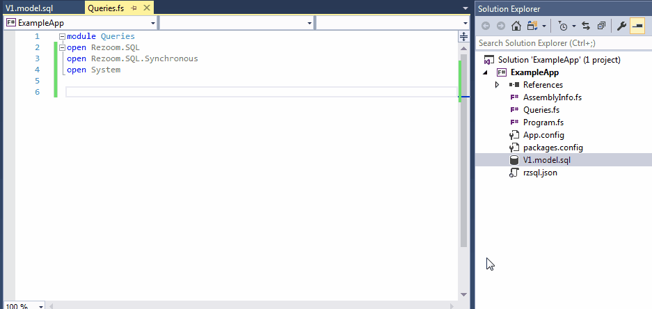
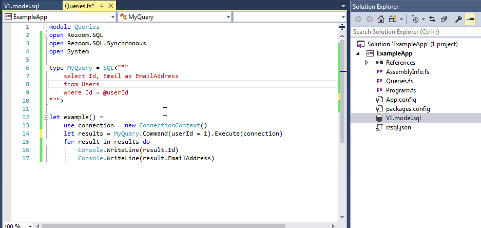

test

[](https://travis-ci.org/rspeele/Rezoom.SQL)

[Tutorial & full documentation](https://rspeele.gitbooks.io/rezoom-sql/doc/Tutorial/)

[Query playground -- try out the SQL dialect live!](http://rzsql.net/#52632EC5A298CFFFD652D53C03DD1318A9DACA3C)

# Statically typed SQL for F# #

Rezoom.SQL is an F# ORM for SQL databases.

It integrates with the F# compiler via a generative type provider to statically
typecheck its own dialect of SQL. It knows how to translate this SQL dialect to
various backends. Currently it supports SQLite, SQL Server, and PostgreSQL.

The type provider makes it fast and easy to write SQL statements, run them, and
consume their results from your F# code with full type safety. You don't need to
install any editor extensions or custom tooling, just add a NuGet package and
you're off and running writing code like this:



## Database schema inferred from migration scripts

In order to typecheck your queries, Rezoom.SQL has to know your database schema
(so it can know, for example, that the `Id` column in the `Users` table is an
int). It learns the schema by reading your migration scripts and observing what
tables and views are created, columns added, and so on.

When developing the first iteration of your application (or a new feature with
its own migration script), it's easy to sketch out a model then go back and
change it as you code, without having to touch a real database until you're
ready to run.

Here's an example. You might want to refresh the page to start the GIF from the
beginning.



Because this is a generative type provider, it makes plain old .NET types you
can use from other languages. That is, you can write an F# project that uses
Rezoom.SQL and defines your migrations and queries, then reference that from C#
or VB.NET projects and use the generated query types with no problem in those
langages. There is even an option to represent nullable types with C#-style
`System.Nullable<T>` instead of `FSharpOption<T>` to make this scenario work
extra smoothly.

Check out the [query
playground](http://rzsql.net/#52632EC5A298CFFFD652D53C03DD1318A9DACA3C) to see
what kinds of SQL you can write.

## The productivity of static typing

When you make schema changes -- for example, replacing `FirstName` and
`LastName` fields with a single `FullName` field -- it's comforting to know the
compiler will point out the queries you need to update.

The typechecker also tightens up the feedback loop, so you don't waste your time
tracking down typos and trivial SQL mistakes you'd normally only encounter at runtime.

Here are just a handful of possible errors you'll be informed of at compile time
and can fix in seconds. There are currently over 45 different error types that
can be detected at compile time.

### Mistyped table names


### Incompatible data types


### Selecting columns not included in a `GROUP BY` clause


## Flexible migration order for working in teams

Since Rezoom.SQL understands the language, it knows that some migrations like
`alter table X add column Y` and `alter table X add column Z` can be run in any
order and produce the same effects.

When you're working with a team, you can take advantage of this to add the
tables and columns you need for the feature you're coding, while your other team
members do the same for their features -- _without_ having to decide the **One
True Migration Order** when you merge.

See details [here](https://rspeele.gitbooks.io/rezoom-sql/doc/Configuration/MigrationTrees.html).

# Integration with Rezoom

You can use Rezoom.SQL by itself, as in the example code above.

But as the name implies, it's designed to work with
[Rezoom](https://github.com/rspeele/Rezoom). When you use it with Rezoom, you can
take advantage of automatic caching and combine units of business logic to share round trips
to the database.

## Automatic batching

With Rezoom, you build up a `Plan` to represent a transaction, which may involve
multiple SQL commands (or web API calls, or other high-latency data manipulation).

If you have one `Plan` called `threeTrip` that makes 3 queries, and another
called `twoTrip` that makes 2 queries, you can choose whether to combine them
sequentially for 5 round trips to the database...

```fsharp
let sequential =
    plan {
        let! x = threeTrip
        let! y = twoTrip
        return (x, y)
    }
```


Or concurrently, for 3 round trips to the database. The first two query batches
sent to the database will include pending queries from *both* `threePlan` and
`twoTrip`:

```fsharp
let concurrent =
    plan {
        let! x, y = threeTrip, twoTrip
        return (x, y)
    }
```


## Automatic caching

Each statically typed query comes with some useful info for caching:

* A compiler-generated ID
* A boolean indicating whether it could make sense to cache (has no side effects, does not use rand(), newid(), etc)
* A bitmask of the tables it reads from
* A bitmask of the tables it writes to

Rezoom uses this cache info to avoid unnecessarily re-querying for the same data
during the execution of a `Plan` (i.e. within a transaction).

This means if you have 30 different functions that call
`LoadUserPermissions(currentUserId)`, only 1 query for permissions will actually
be run when you use those functions together in a transaction. Unless, of
course, you edit the permissions table during the course of the transaction, in
which case the cached result will automatically be invalidated and the
permissions re-queried next time they are requested.

This lets you safely check all the invariants you need for each method in your
domain layer, without fear of causing mountains of redundant queries, and
without any of the effort of writing your own caching layer.

## Get started

To get started using RZSQL, read the
[tutorial](https://rspeele.gitbooks.io/rezoom-sql/doc/Tutorial/). It'll get you
up and running in 5 minutes or your money back.

